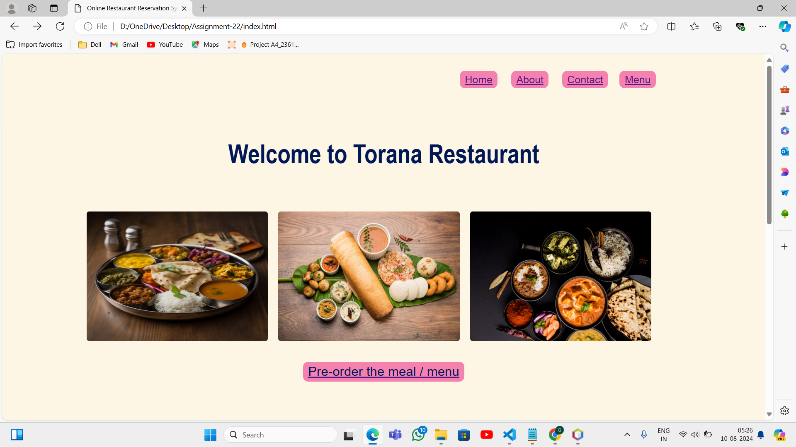
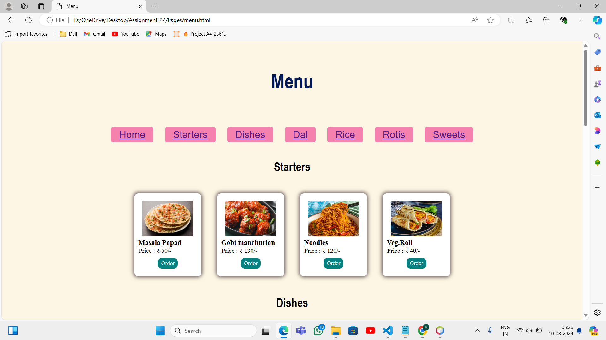

# Online Restaurant Reservation System
## Project Overview
Welcome to Torana Restaurant 
by online restaurant  menu ordering website user will be able to 
pre-order the meal which he\she wants to eat in the restaurant is available 
in his\her desirable restaurant on any fixed time.
 But through our website customers can  'pre-order the food online' from his\her home through internet.
 The menu is also given through which customers can pre-order the dishes .

This system really help customers to save the time of waiting in the queue of 
restaurant for the tables as well as waiting for the dishes to get prepared. This developed project also helps restaurant owner to automate his\her business operations and widely scale his\her business.

## Objectives
plan to achieve by the end of project.

- Improve customer experience
- User-friendly interface to the customers
- Customers don’t have to wait in lines anymore
- Flexibility to the customers
- Improve staff management
- Pre-ordering options
- Save customers valuable time
- No waste of time while waiting for dishes

[Home Page Screenshot]

[Menu Page Screenshot]

[ Visit to website ](https://assignment-22-phi.vercel.app/index.html)